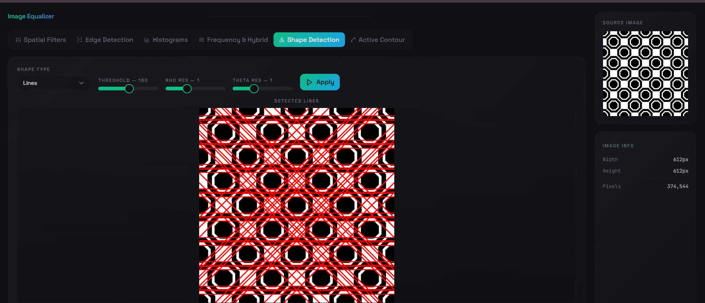
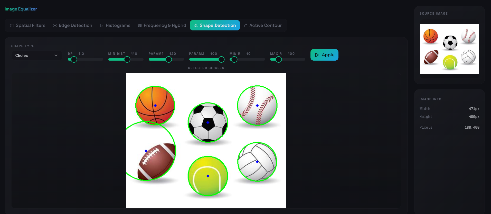
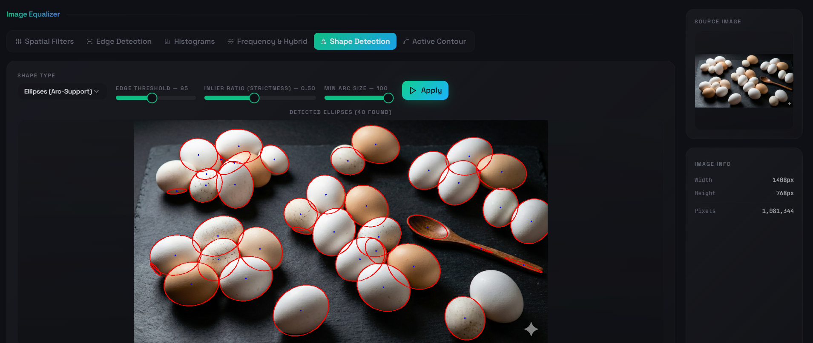
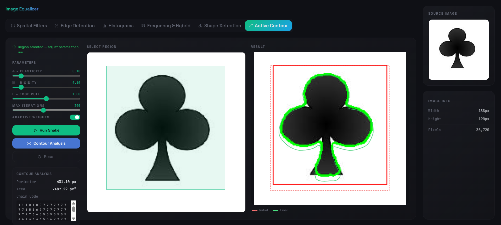

# Image Preprocessing 

This repository contains a Python-based application for comprehensive image preprocessing and computer vision tasks. The project is designed with a graphical user interface (UI) to test and observe the effects of various algorithms, parameter variations, and filtering methods. It provides a robust pipeline useful for everything from general computer vision tasks to specialized fields like medical image analysis.

## 🚀 Features

The project is divided into two main milestones, covering fundamental image processing techniques and advanced feature extraction.

### Milestone 1: Image Processing Fundamentals & Filtering
* **Noise Addition & Filtering:** * Add uniform, Gaussian, and salt & pepper noise.
  * Apply low-pass filters (Average, Gaussian, and Median) using varying kernel sizes (e.g., $3 \times 3$ and $5 \times 5$).
  
  
  

* **Edge Detection:**
  * Extract edges using Sobel, Roberts, and Prewitt masks (with previews in both X and Y directions).
  
  
  * Canny edge detection.
   
  
* **Histograms & Enhancement:**
  * Plot histograms and cumulative distribution functions.
   
    
  
  
  * Perform image equalization and normalization.
   
   
  
  * Transform color images to grayscale and plot R, G, and B histograms.
   
   
  
* **Frequency Domain Analysis:**
  * Apply High-pass and Low-pass frequency domain filters.
  * Generate hybrid images by combining the low frequencies of one image with the high frequencies of another.
   
  

### Milestone 2: Feature Extraction & Active Contours
* **Shape Detection:** * Utilize the Canny edge detector in combination with detection algorithms (like the Hough Transform) to identify lines, circles, and ellipses in both grayscale and color images.
  * Superimpose the detected shapes directly onto the original images.
  
  
  
* **Active Contour Model (Snakes):**
  * Initialize contours for specific objects.
  * Evolve the Active Contour Model using the greedy algorithm.
  * Represent the final output as a chain code.
  * Compute and display the area and perimeter inside the detected contours.
  

## 🛠️ Technologies & Libraries Used
* **Python 3.x**
* **OpenCV (`cv2`):** Used primarily for basic image reading, noise generation, and Canny edge detection (as specified in Task 1).
* **NumPy:** For matrix operations, custom filter implementations, and frequency domain manipulations.
* **Matplotlib:** For plotting histograms and distribution curves.

## 👥 Contributors

|  |  |  |  |  |
|:---:|:---:|:---:|:---:|:---:|
| [**Raghad Abdelhameed**](https://github.com/RaghadAbdelhameed) | [**Salma Ali**](https://github.com/Salmaa-Ali) | [**Amany Othman**](https://github.com/Amany-Othman) | [**Rawan Mohamed**](https://github.com/rawan-mohamed-n) | [**Olivia Morkos**](https://github.com/oliviamorkos)